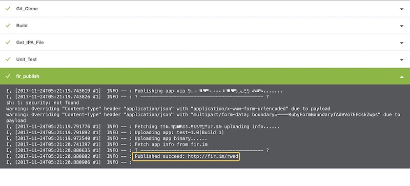

# iOS 项目构建

**模板地址：**

`https://github.com/flowci/templates/blob/master/ios.flow.yml`

此模板使用 fastlane 构建 iOS 项目

**使用前的准备：**

在 Agent 所工作的机器上，需要安装：

- fastlane: 具体请参见 <a href="https://docs.fastlane.tools/getting-started/ios/setup/">https://docs.fastlane.tools/getting-started/ios/setup/</a>
- 证书: 在 Agent 上，手工导入 iOS 项目所需要的 `.provisionprofile` 以及 `.p12` 文件

**调整 YML 配置：**

- 配置 Agent 工作环境:
  
  - `FLOW_AGENT_WORKSPACE`: Agent 的工作目录，如果删除此参数，则 Agent 默认工作目录为 `${HOME}` 目录。
  - `FLOW_ENV_OUTPUT_PREFIX`: 环境变量输出前缀，此参数控制环境变量是否能传递到后续的步骤中。例如，设置 `FLOW_ENV_OUTPUT_PREFIX=IOS_OUTPUT_`，在构建脚本中使用环境变量 `export IOS_OUTPUT_IPA_PATH=xxx`, 则在后续的步骤中可以直接使用 `echo ${IOS_OUTPUT_IPA_PATH}`。

- 配置 iOS 构建环境:

  根据每个 iOS 项目的不同，根据需要可以配置不同的构建参数:

  - `IOS_PROJECT_NAME`: iOS 项目名称
  - `IOS_SCHEME`: iOS 项目 scheme 的名称
  - `IOS_EXPORT_METHOD`: iOS 打包方式，可以使用 `app-store, ad-hoc, package, enterprise, development, developer-id`
  - `IOS_IPA_DIR`: iOS IPA 文件输出目录

**fir.im 上传:**

- 首先在终端运行以下命令安装 fir.sh：

  `curl https://raw.githubusercontent.com/FIRHQ/fir-cli/master/fir.sh -o /usr/local/bin/fir`

  `chmod +x /usr/local/bin/fir`

- 登录 [fir 账户](https://fir.im/apps)， 获取 token，启动 docker 并在终端执行以下命令（第一次会自动下载 fir-cli 镜像）：

  `fir login token`

- 在 YML 工作流最后添加 fir 发布脚本，如下：

  ```yml
  - name: fir_publish
    script: |
      array=$(find ${IOS_IPA_DIR} -name *.ipa 2>&1)
      for file in ${array[@]}
      do
        fir publish $file
      done
  ```

发布效果：



<br/><br/><br/>
<div id="bom">
<a href="./quick_flowconfig.md">下一节：flowci 整体架构 </a> | 
<a href="#">下一节：最佳实践 </a>
</div>
<link rel="stylesheet" rev="stylesheet" href="flow.css" type="text/css"/> 